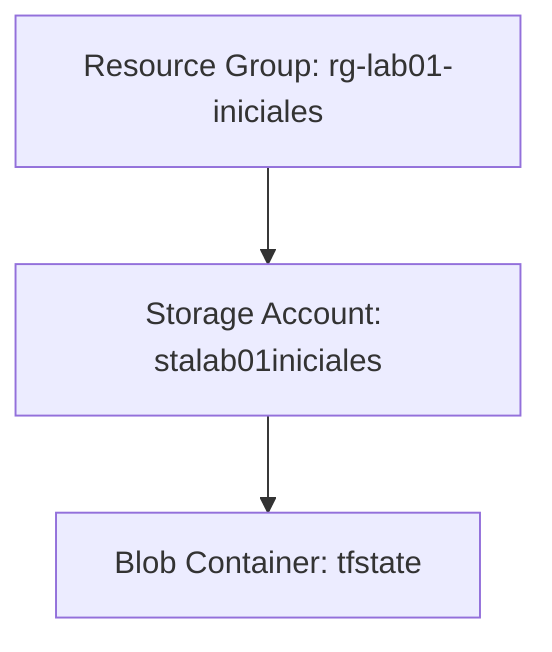

# Laboratorio 1 — Primer despliegue Terraform en Azure

Práctica guiada para realizar tu primer despliegue de Infraestructura como Código (IaC) en Microsoft Azure utilizando Terraform.

---

## Quick Start

Sigue estos comandos mínimos en tu terminal para ejecutar el despliegue del laboratorio:

```bash
# 1. Iniciar sesión en tu suscripción de Azure
az login

# 2. Inicializar Terraform en el directorio del proyecto
cd lab01
terraform init

# 3. Previsualizar la infraestructura a crear
terraform plan

# 4. Crear los recursos en la nube de Azure
terraform apply

# 5. Destruir la infraestructura al finalizar la práctica
terraform destroy
```

---

## Features

* **Aprovisionamiento Automatizado (IaC):** Creación simultánea y coordinada de un Resource Group, Storage Account y Blob Container en Azure.
* **Configuración Parametrizada:** Flexibilidad en nombres y ubicaciones geográficas para evitar colisiones a través de variables de entrada.
* **Inspección de Estado:** Práctica dirigida al análisis del archivo de estado local `terraform.tfstate` para comprender la correspondencia de infraestructura.

---

## Configuration

| Variable | Descripción | Por defecto |
|----------|-------------|---------|
| `alumno_iniciales` | Iniciales del alumno para personalizar el Resource Group y Storage Account (ej. `ua`). | `"ua"` |
| `location` | Región geográfica de Azure donde se desplegarán los recursos. | `"westeurope"` |

---

## Documentation

### 📚 Relación con la Teoría

Este laboratorio práctico refuerza directamente los siguientes conceptos fundamentales de la materia:
* **Infraestructura como Código (IaC):** Gestión y aprovisionamiento de infraestructura a través de archivos de definición legibles por máquina, en lugar de configuración manual.
* **Workflow de Terraform:** El flujo de trabajo estándar en tres fases: *Write* (escribir el código), *Plan* (previsualizar cambios) y *Apply* (ejecutar el despliegue).
* **Proveedores (Providers):** Plugins que permiten a Terraform interactuar con las APIs de los diferentes proveedores de nube (en este caso, `azurerm` para Azure).
* **Recursos (Resources):** Componentes individuales de infraestructura (como grupos de recursos, cuentas de almacenamiento y contenedores) declarados en el código.
* **Estado (State):** El mecanismo que utiliza Terraform para mapear los recursos de tu archivo de configuración con la infraestructura real desplegada en la nube (`terraform.tfstate`).
* **Comandos Básicos:** Uso práctico de la interfaz de comandos (CLI) de Terraform para el ciclo de vida de los recursos.

---

### 🎯 Objetivos del Laboratorio

El alumno deberá:
1. **Instalar y configurar** Terraform y Azure CLI en su máquina local.
2. **Autenticarse** en su suscripción de Azure desde la terminal.
3. **Inicializar** un proyecto de Terraform descargando los proveedores necesarios.
4. **Desplegar** infraestructura básica (Resource Group, Storage Account, Blob Container).
5. **Interpretar** planes de ejecución y entender los cambios propuestos.
6. **Inspeccionar y analizar** el archivo de estado (`terraform.tfstate`).
7. **Destruir** de forma limpia y ordenada los recursos creados para evitar costes.

---

### 🏗️ Infraestructura a Desplegar

Desplegaremos los siguientes recursos lógicos en Azure:



* **Resource Group:** Contenedor lógico que agrupa los recursos relacionados de una solución de Azure.
* **Storage Account:** Cuenta de almacenamiento que proporciona un espacio de nombres único para tus datos.
* **Blob Container:** Contenedor dentro de la cuenta de almacenamiento para guardar objetos (blobs), en este caso denominado `tfstate`.

---

### ⏱️ Tiempo Estimado

| Fase | Actividad | Tiempo Estimado |
| :--- | :--- | :---: |
| **Fase 1** | Preparación del entorno | 30 min |
| **Fase 2** | Escritura de código | 60 min |
| **Fase 3** | Ejecución y troubleshooting | 45 min |
| **Fase 4** | Cleanup y revisión del estado | 45 min |
| **Total** | | **3 horas** |

---

### 🚀 Guía Paso a Paso Detallada

#### Parte 1 — Preparación del Entorno
1. **Instalar Herramientas:**
   Asegúrate de contar con los siguientes elementos instalados en tu sistema:
   * **Terraform CLI**: [Descargar Terraform](https://developer.hashicorp.com/terraform/downloads) (Asegúrate de agregarlo a la variable de entorno PATH).
   * **Azure CLI**: [Descargar Azure CLI](https://learn.microsoft.com/es-es/cli/azure/install-azure-cli) (Esencial para la autenticación).
   * **VS Code + Extensiones**: Se recomienda utilizar [VS Code](https://code.visualstudio.com/) junto con la extensión oficial **HashiCorp Terraform** para obtener autocompletado y resaltado de sintaxis.

2. **Verificar Versiones:**
   Abre una terminal y ejecuta los siguientes comandos para validar que ambas herramientas están correctamente instaladas:
   ```bash
   terraform version
   az version
   ```

3. **Autenticación en Azure (Login):**
   Inicia sesión en tu cuenta de Azure ejecutando:
   ```bash
   az login
   ```
   > [!NOTE]
   > Este comando abrirá una ventana en tu navegador web para que inicies sesión con tus credenciales de Azure. Una vez completado, la terminal mostrará la lista de suscripciones asociadas a tu cuenta.

#### Parte 2 — Estructura del Proyecto
Crea un directorio de trabajo llamado `lab01` con la siguiente estructura de archivos:
```text
lab01/
 ├── provider.tf   # Configuración de proveedores y versiones de Terraform
 ├── variables.tf  # Variables de entrada del módulo
 ├── main.tf       # Definición de recursos de Azure
 └── outputs.tf    # Valores de salida resultantes
```

#### Parte 3 — Configurar el Proveedor `azurerm`
En el archivo `provider.tf`, debes declarar el proveedor oficial de Azure y configurar el bloque de características requerido (`features`):
```hcl
terraform {
  required_version = ">= 1.0.0"
  required_providers {
    azurerm = {
      source  = "hashicorp/azurerm"
      version = "~> 3.0"
    }
  }
}

provider "azurerm" {
  features {}
}
```

#### Parte 4 — Crear el Resource Group
En el archivo `variables.tf`, define las iniciales del alumno para personalizar el despliegue:
```hcl
variable "alumno_iniciales" {
  type        = string
  description = "Iniciales del alumno (ej. jgp para Juan García Pérez)"
  default     = "ua"
}

variable "location" {
  type        = string
  description = "Región de Azure para el despliegue"
  default     = "westeurope"
}
```

En el archivo `main.tf`, define tu **Resource Group**:
```hcl
resource "azurerm_resource_group" "lab01" {
  name     = "rg-lab01-${var.alumno_iniciales}"
  location = var.location
}
```
> [!IMPORTANT]
> Recuerda cambiar el valor por defecto de `alumno_iniciales` en tu archivo `variables.tf` o pasar la variable al ejecutar el comando para evitar colisiones con otros compañeros.

#### Parte 5 — Crear la Storage Account
Las cuentas de almacenamiento en Azure tienen restricciones estrictas impuestas por la API de Microsoft. Agrega lo siguiente a tu `main.tf`:
```hcl
resource "azurerm_storage_account" "lab01" {
  name                     = lower("stalab01${var.alumno_iniciales}")
  resource_group_name      = azurerm_resource_group.lab01.name
  location                 = azurerm_resource_group.lab01.location
  account_tier             = "Standard"
  account_replication_type = "LRS"

  tags = {
    Environment = "Lab01"
    Owner       = var.alumno_iniciales
  }
}
```
> [!WARNING]
> **Restricciones de Azure para Storage Accounts:**
> 1. **Nombre Único Global:** Ningún otro usuario en todo Azure puede tener una Storage Account con el mismo nombre.
> 2. **Solo Minúsculas y Números:** No se admiten mayúsculas, guiones (`-`) ni caracteres especiales.
> 3. **Longitud:** Debe tener entre 3 y 24 caracteres.

#### Parte 6 — Crear el Blob Container
Añade al final del archivo `main.tf` el recurso para crear el contenedor privado donde guardaremos archivos:
```hcl
resource "azurerm_storage_container" "tfstate" {
  name                  = "tfstate"
  storage_account_name  = azurerm_storage_account.lab01.name
  container_access_type = "private"
}
```

#### Parte 7 — Workflow de Terraform (Comandos Obligatorios)
Sigue detalladamente este orden secuencial para ejecutar el ciclo de vida del laboratorio:
1. **Inicialización:** Descarga los plugins del proveedor `azurerm` especificados en tu `provider.tf`.
   ```bash
   terraform init
   ```
2. **Planificación:** Genera y muestra un plan de ejecución. Te permite examinar qué recursos se crearán, modificarán o destruirán sin alterar nada en la nube real.
   ```bash
   terraform plan
   ```
   > [!TIP]
   > Observa el resumen final del plan: `Plan: 3 to add, 0 to change, 0 to destroy`. Comprueba que los nombres y la ubicación de los recursos sean correctos.
3. **Aplicación:** Aplica los cambios en Azure. Terraform te pedirá confirmación explícita escribiendo `yes`.
   ```bash
   terraform apply
   ```
   Una vez completado el despliegue con éxito, verás los valores declarados en `outputs.tf` impresos en tu consola.
4. **Destrucción:** Al finalizar el laboratorio, elimina **todos** los recursos creados para evitar consumir créditos en tu suscripción de Azure.
   ```bash
   terraform destroy
   ```
   *(Escribe `yes` cuando te sea solicitado).*

#### Parte 8 — Análisis del State
Una vez que ejecutes `terraform apply`, verás un nuevo archivo creado en tu directorio: **`terraform.tfstate`**.

> [!CAUTION]
> El archivo `.tfstate` contiene toda la información de la infraestructura desplegada, incluyendo metadatos de configuración y **secretos o contraseñas en texto claro**. Nunca expongas este archivo públicamente ni lo subas a repositorios de Git públicos sin protección (agrega `*.tfstate` a tu `.gitignore`).

##### Actividad de Inspección:
Abre el archivo `terraform.tfstate` con tu editor y localiza los siguientes elementos:
1. **Resource IDs:** Identificador único de Azure para tu Resource Group (`/subscriptions/.../resourceGroups/rg-lab01-...`).
2. **Outputs:** Los valores que declaraste en `outputs.tf` mapeados con sus respectivos valores reales.
3. **Metadata:** Versión de Terraform que creó el estado y firma del archivo.

---

### 🛠️ Problemas Típicos y Solución de Errores

#### 1. Error: `Storage Account name already taken`
* **Causa:** El nombre resultante de `stalab01<iniciales>` ya está en uso por otro usuario en la nube de Azure de forma global.
* **Solución:** Modifica el valor de la variable `alumno_iniciales` en tu archivo `variables.tf` para añadir más caracteres o un número aleatorio (ejemplo: `uax42`) y vuelve a ejecutar `terraform plan` y `terraform apply`.

#### 2. Error: `The Resource Group was not found`
* **Causa:** Has intentado crear la Storage Account en un Resource Group que no se ha terminado de crear, o existe un error de orden de dependencias en el código.
* **Solución:** Terraform gestiona las dependencias implícitas automáticamente al hacer referencia a `azurerm_resource_group.lab01.name`. Asegúrate de no haber hardcodeado el nombre del grupo de recursos en la declaración de la Storage Account.

---

## License

MIT
